# CodePilot OS - Software Architecture Document

| Document control | Value |
|---|---|
| Product | CodePilot OS |
| Scope | Phase 1 MVP |
| Status | Architecture baseline |
| Source of truth | `00_Project_Management/PRD.md` |
| Last updated | 2026-07-24 |

## 1. Executive Summary

CodePilot OS is a human-supervised, multi-agent engineering workspace. Its architecture separates the interactive product experience from long-running, isolated repository and AI work. A Next.js application provides the dashboard, while a FastAPI service owns identity, policy enforcement, durable workflow state, and the public API. PostgreSQL is the transactional system of record; Redis provides caching, rate limiting, and background-job coordination. GitHub is the sole version-control integration for the MVP. OpenAI Responses API/Codex provides the reasoning runtime behind specialized agent roles.

The key architectural decision is to model each request as a durable **run** bound to an approved plan revision and an immutable repository commit SHA. Agents are not autonomous services with unrestricted power: they are role-specific stages in a state machine. Only explicitly authorized write stages may alter a run-local workspace; default and protected branches are never modified automatically. Every significant decision, transition, artifact, policy block, and export is persisted as auditable evidence.

This design is deliberately modular but hackathon-feasible. It starts as a deployable modular monolith: one API service, one worker service, one database, one Redis instance, and managed object storage. Clear service boundaries and versioned event schemas allow later extraction without requiring distributed systems complexity in the MVP.

## 2. High-Level Architecture

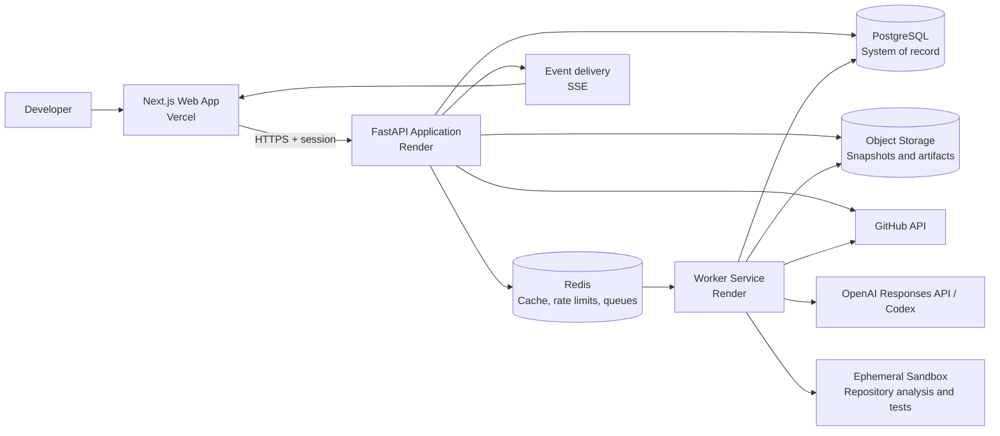

The browser never calls GitHub, OpenAI, the worker, or sandbox directly. The API is the policy enforcement point and the only authority that can create a run, approve a plan, enqueue a stage, or create an export. Workers perform asynchronous work from durable instructions and emit events; they cannot make business-state transitions outside the workflow rules.

## 3. System Components

| Component | Technology | Purpose | MVP deployment |
|---|---|---|---|
| Web application | Next.js, React, TypeScript, Tailwind, shadcn/ui | Project dashboard, requests, approval, review, live status. | Vercel |
| API application | FastAPI, Python | Auth, REST API, workflow command handling, authorization, event feed. | Render web service |
| Workflow worker | Python worker process | Repository analysis, agent stages, sandbox coordination, artifact collection. | Render worker service |
| PostgreSQL | Managed PostgreSQL | Durable relational data, workflow state, audit records, metadata. | Render PostgreSQL or compatible managed service |
| Redis | Managed Redis | Queue transport, short-lived cache, idempotency/rate-limit state, pub/sub. | Render Redis or compatible managed service |
| Object storage | S3-compatible bucket | Repository snapshots, sanitized logs, diffs, reports, archives. | Managed object storage |
| GitHub integration | GitHub OAuth and REST/Git APIs | Repository discovery, snapshot retrieval, optional branch/commit export. | External |
| AI runtime | OpenAI Responses API / Codex | Structured agent reasoning and tool-directed work. | External |
| Sandbox runner | Ephemeral restricted container | Static analysis, approved test commands, local Git operations. | Worker-managed or managed sandbox provider |

## 4. Component Responsibilities

| Component | Owns | Must not own |
|---|---|---|
| Next.js app | Presentation, local interaction state, authenticated API calls, optimistic non-authoritative UI. | Workflow truth, secrets, GitHub write credentials, direct model calls. |
| FastAPI API | Commands, read models, auth/session verification, RBAC, validation, audit creation, enqueueing, event authorization. | Long-running analysis or executing untrusted code inline. |
| Workflow worker | Idempotent execution of approved jobs, agent tool orchestration, artifact production, progress events. | User-facing authorization decisions or direct browser sessions. |
| PostgreSQL | Canonical entities, state transitions, immutable audit/event metadata, transactional outbox. | Large source snapshots/log blobs. |
| Redis | Ephemeral coordination and delivery acceleration. | Source of truth for approvals, plans, or terminal status. |
| Object storage | Immutable/retained large artifacts addressed by metadata. | Authorization policy; all signed access is issued by API. |
| Sandbox | Execute restricted, bounded project commands. | Persistent secrets, durable workflow state, public network access. |

## 5. Overall Data Flow

1. The user authenticates and connects GitHub through a server-side OAuth flow.
2. The API stores an encrypted connection record, creates a project pointing at a repository/default branch, and places an analysis job in the outbox/queue.
3. The worker retrieves a pinned repository snapshot into a sandbox, applies exclusion and secret-scanning policy, builds analysis artifacts, and stores them in object storage with metadata in PostgreSQL.
4. The user submits a request. Planner and Architect stages produce structured plan/review artifacts. The API exposes the latest plan revision for editing and approval.
5. Approval atomically pins the plan revision and source SHA as the execution baseline, creates a run, records the audit event, and enqueues the first eligible stage.
6. The worker advances the controlled stage graph, publishing durable events and artifacts. Write stages act only in a run-specific workspace/branch.
7. The API streams authorized events to the dashboard using Server-Sent Events (SSE). The dashboard refreshes detail views from API read models after events.
8. Completion yields a unified review package. Export is a separate explicit command that can create the permitted GitHub artifact or a patch; it is never implicit.

## 6. Frontend Architecture

### 6.1 Design

Use the Next.js App Router for route-level server rendering and React client components only where interaction or live state is needed. TypeScript is mandatory for application code and API contracts. Tailwind CSS and shadcn/ui provide a consistent, accessible component foundation without requiring a bespoke design system for the MVP.

The frontend is a Backend-for-Frontend consumer, not a second business layer. It receives normalized resource representations from FastAPI and does not infer authorization, workflow transitions, or agent status from local state.

### 6.2 Route and UI boundaries

| Route area | Primary views | Data behavior |
|---|---|---|
| `/projects` | Project list, connection/import | Server-render list; mutation through API. |
| `/projects/:id` | Overview, intelligence, requests, runs | Project-scoped shell; fetch summarized read models. |
| `/projects/:id/requests/:id` | Request editor, plan revisions, approval | Form validation client-side and server-side; no execution control without server response. |
| `/projects/:id/runs/:id` | Live overview, plan, timeline, changes, tests, docs, evaluation | Initial snapshot plus SSE-driven invalidation. |
| `/settings` | GitHub connection, account, deletion controls | Sensitive actions require re-authentication where applicable. |

### 6.3 Client state

Use three categories of state:

| State | Location | Examples |
|---|---|---|
| Server state | Query cache (e.g., TanStack Query) keyed by resource/version | Project, plan revision, run details, artifacts. |
| URL state | Route/search parameters | Selected project, run tab, filters, diff file. |
| Ephemeral UI state | Component state | Open panel, unsaved form text, focused diff line. |

SSE messages contain event IDs, resource IDs, event type, and version, rather than complete mutable run documents. On receipt, the client invalidates/refetches appropriate queries. This avoids duplicated truth and keeps reconnect behavior simple.

### 6.4 Accessibility and UX architecture

The frontend meets the PRD's WCAG 2.2 AA target. All state is conveyed by text and icon in addition to color; event stream announcements are rate-limited ARIA live updates; approval and cancellation controls remain keyboard reachable. The diff view exposes file tree navigation and textual change summaries. Animation is optional and respects reduced-motion settings.

## 7. Backend Architecture

FastAPI is organized as a modular monolith with domain modules, a thin HTTP layer, application services, repository adapters, and infrastructure integrations. The API process is intentionally stateless: it can be horizontally scaled, while PostgreSQL owns consistency and Redis/object storage serve supporting concerns.

| Layer | Responsibility | Examples |
|---|---|---|
| HTTP/API | Request parsing, response serialization, auth dependency, error mapping. | Project routes, run routes, webhook routes. |
| Application | Use cases and transactions. | ApprovePlan, CreateRun, CancelRun, ExportRun. |
| Domain | Invariants and transition rules. | Run state graph, severity gating, policy decisions. |
| Persistence | Transactional reads/writes and outbox. | SQLAlchemy repositories, migrations. |
| Integrations | Isolated provider clients. | GitHub, OpenAI, Redis, storage, sandbox. |

All commands carry an authenticated actor and idempotency key where retry may cause side effects. Commands first validate project membership and role, then verify the current entity version/state inside a database transaction. The transaction writes state plus audit/outbox records together. A dispatcher publishes outbox items after commit, guaranteeing jobs are not lost between database write and queue publication.

## 8. AI Agent Framework

The agent framework treats each specialist as a constrained workflow stage rather than a peer-to-peer autonomous process. A shared runtime invokes OpenAI Responses API/Codex with role-specific instructions, a structured input envelope, a policy-filtered context pack, and a required structured output schema.

| Agent | Input | Allowed tools | Output contract | Write permission |
|---|---|---|---|---:|
| Planner | Request, analysis summary, constraints | Read repository context | Plan, assumptions, questions, impact, test strategy | No |
| Architect | Plan, repository map, conventions | Read repository context | Architecture review, risks, recommended boundaries | No |
| Developer | Approved baseline, scoped files, policy | Read/write run workspace, targeted search | Diff, notes, changed paths, validation handoff | Scoped source |
| Reviewer | Approved plan, diff, test evidence | Read artifacts/repository | Findings with severity, evidence, disposition | No |
| QA | Plan, diff, discovered test config | Test-file writes, approved commands | Test changes, executions, results, manual checks | Test paths |
| Documentation | Plan, diff, repo docs | Documentation-path writes | Doc change and rationale | Docs paths |
| Evaluator | Criteria, plan, all artifacts | Read artifacts | Per-criterion score and evidence links | No |

The framework validates each output against a versioned JSON schema before it can influence downstream work. Invalid outputs become retriable stage failures, not free-form instructions. Model tool calls are brokered by the worker; the model does not receive filesystem, shell, network, or GitHub credentials directly.

### Context assembly and safety

Context assembly is deterministic and policy-aware. It prioritizes approved plan material, repository analysis citations, affected files, local conventions, and relevant test/configuration files. It applies size budgets, strips or redacts secret-like values, excludes binaries/vendor/generated files by default, and wraps repository content as untrusted reference material. Instructions found in source code or documentation never override platform policy or agent instructions.

## 9. Agent Communication Model

Agents communicate through persisted artifacts and workflow events, never direct unconstrained messages. Each stage reads a stable input snapshot and writes a named artifact. This makes handoffs inspectable, supports retries, and prevents hidden mutable context.

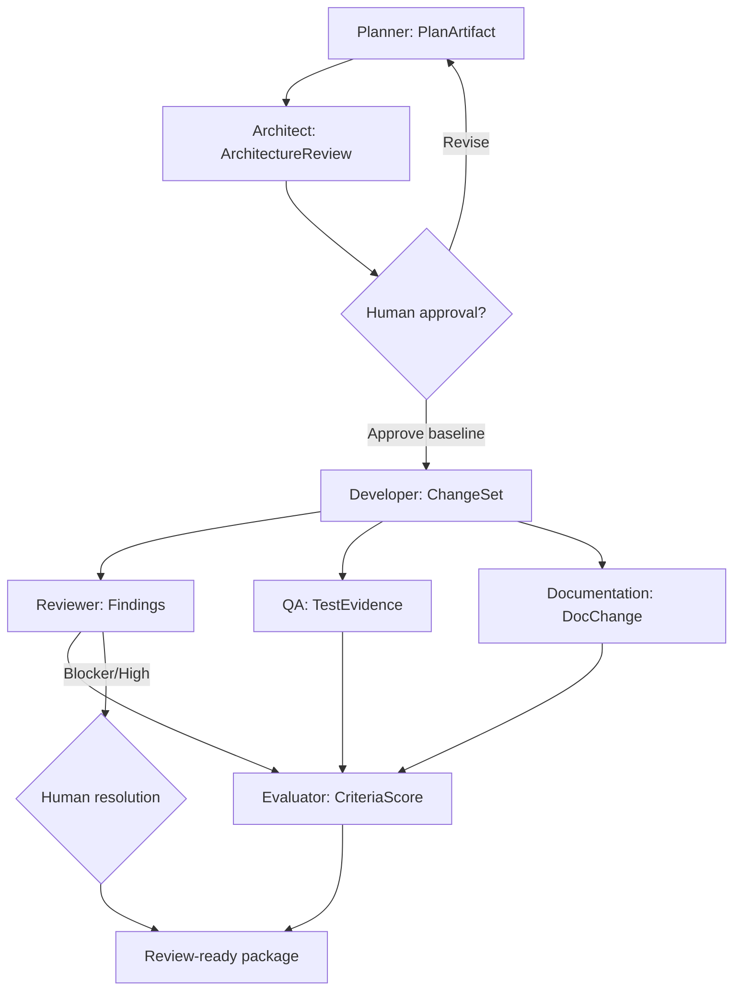

The orchestration engine maintains a dependency graph. Stages with independent read-only dependencies may run concurrently after Developer output is available, subject to project concurrency and sandbox capacity. Write stages are serialized by workspace lock or configured deterministic merge order. Every artifact includes `run_id`, `stage_id`, schema version, source SHA, input artifact references, producer runtime version, and creation time.

## 10. Repository Analysis Pipeline

```mermaid
flowchart LR
  A[Project import] --> B[Resolve default branch SHA]
  B --> C[Create isolated snapshot]
  C --> D[Policy filter\nsize, binary, secrets]
  D --> E[Static inventory\nfiles, manifests, languages]
  E --> F[Convention discovery\nCI, tests, entry points]
  F --> G[Build cited context pack]
  G --> H[AI architecture summary]
  H --> I[Persist analysis + artifacts]
  I --> J[Mark analysis ready]
```

1. The API obtains the repository identity and target branch through GitHub and records the resolved commit SHA.
2. A worker creates a shallow snapshot in an ephemeral sandbox. It rejects unsupported size/file-count conditions before expensive model work.
3. Static analyzers inventory paths, file extensions, manifests, lock files, CI definitions, test configuration, top-level modules, and candidate entry points. This step does not execute repository code.
4. A policy filter excludes binaries, generated/vendor content, ignored sensitive paths, and secret-bearing content from model context. It records exclusions as metadata.
5. The worker builds a repository map and citation index. The architecture summary is generated only from this bounded context and labels deductions as inferences.
6. Results are stored with the exact source SHA. A GitHub default-branch SHA change marks analysis stale. A stale analysis cannot serve as the baseline for write-capable execution.

## 11. Feature Execution Pipeline

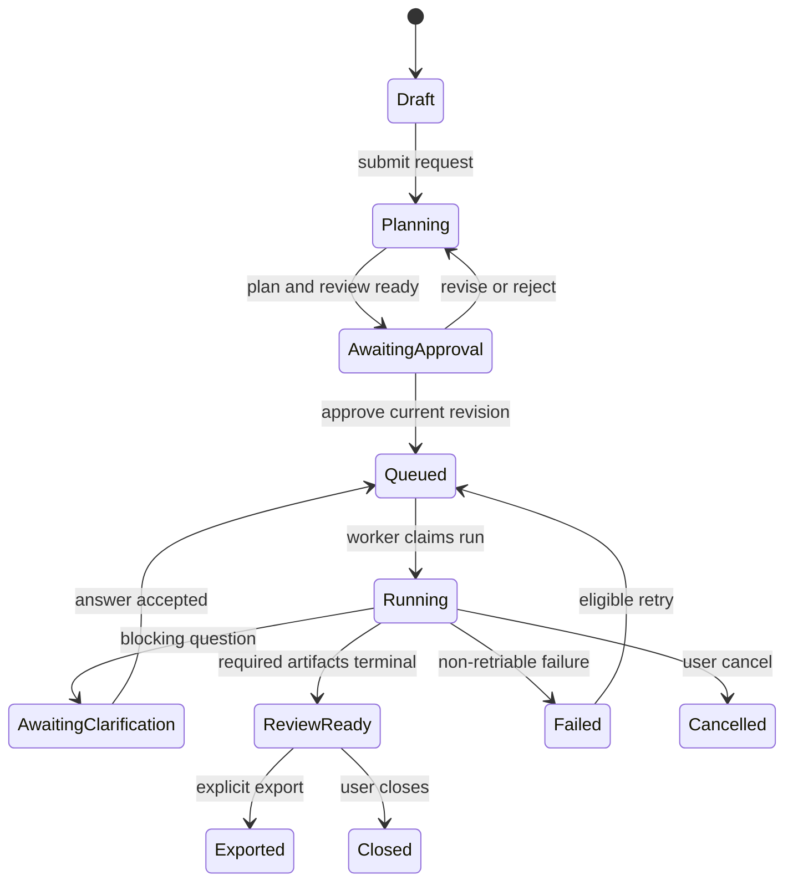

The transition authority is centralized. The worker can report a stage outcome; the application service evaluates whether that outcome satisfies transition rules. A plan approval transaction records the approver, plan revision, source SHA, policies, and execution budget. It then creates a run-specific workspace identifier and places the initial job in the durable outbox.

The Developer stage may create source changes only under the pinned workspace and path policy. QA and Documentation subsequently modify allowed test/documentation paths in that workspace. The final change set is materialized as a diff/commit object and never merged automatically. Reviewer blockers/high findings and evaluator gaps remain visible even if a user chooses to export after a documented waiver.

## 12. Database Layer

PostgreSQL is the authoritative store for users, projects, plans, runs, artifacts metadata, and audits. Prefer UUID primary keys, `created_at`/`updated_at` timestamps, explicit ownership keys, optimistic `version` columns on mutable workflow entities, and soft deletion where retention policy requires it. Large files live in object storage; tables retain checksums, sizes, media types, encryption metadata, and storage keys.

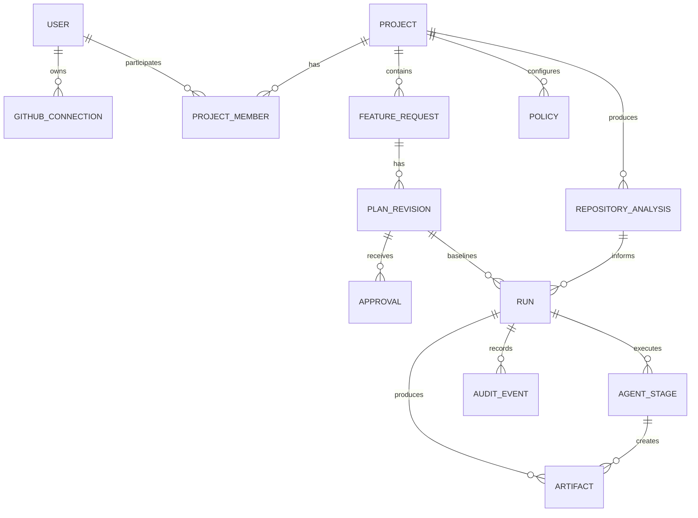

| Entity | Key responsibilities |
|---|---|
| `users`, `sessions`, `github_connections` | Identity, encrypted OAuth credential reference, connection status. |
| `projects`, `project_members`, `policies` | Repository identity, membership, project-level execution limits/path rules. |
| `repository_analyses` | Source SHA, analysis state, summary/map artifact references, freshness. |
| `feature_requests`, `plan_revisions`, `approvals` | User intent, immutable revisions, approval and waiver records. |
| `runs`, `agent_stages` | State machine state, baseline, budget, stage attempts and dependencies. |
| `artifacts`, `test_executions`, `review_findings` | Typed evidence and efficient review query models. |
| `audit_events`, `outbox_events` | Immutable audit trail and reliable asynchronous publication. |

Indexes prioritize project-scoped lists, active-run dashboards, run timelines, stage claim queries, artifact lookup, and audit time-range access. Row-level access is enforced in application queries for the MVP; PostgreSQL row-level security may be added when organizational tenancy requires defense in depth.

## 13. API Layer

Expose a versioned REST API at `/api/v1`. REST is appropriate because the frontend needs resource reads and explicit state-changing commands; workflow complexity is clearer as typed commands than as generic mutation endpoints. OpenAPI is generated from FastAPI models and used to generate TypeScript client types.

| API group | Representative operations | Notes |
|---|---|---|
| Auth/connections | OAuth start/callback, list/disconnect GitHub | OAuth callback is server-side only. |
| Projects | Create/list/get, analyze, get intelligence | Project-scoped authorization. |
| Requests/plans | Create request, submit, list revisions, update draft, approve/reject | Approval requires expected revision/version. |
| Runs | Create after approval, get, cancel, retry stage, answer clarification | Commands are idempotent. |
| Artifacts | List/get diff, test evidence, findings, docs, evaluation | Large content is paginated or signed-download gated. |
| Export | Create patch/branch export, get export status | Separate explicit endpoint. |
| Events | `GET /runs/:id/events` SSE stream | Event IDs support reconnect and `Last-Event-ID`. |

Command responses return the authoritative resource and version. Destructive or high-impact actions require confirmation tokens or explicit body fields. Pagination uses opaque cursors. Error bodies use a stable shape: `code`, `message`, `request_id`, `details` (safe field errors only), and `retryable`.

## 14. Authentication Strategy

Use a managed identity provider or NextAuth-compatible session layer for user login, with server-side session verification at FastAPI. The MVP supports a primary login method selected during implementation (for example GitHub sign-in) and GitHub OAuth connection may be the same or a separate consent flow. Keep application identity and GitHub authorization conceptually separate: a user can remain signed in after disconnecting GitHub.

OAuth authorization code flow uses PKCE, state validation, short-lived authorization codes, HTTPS redirect URIs, and server-side exchange. GitHub tokens are envelope-encrypted at rest; access is limited to the integration adapter and never returned to browser clients. The system requests the minimum scopes needed for selected import/export behavior and provides connection revocation and deletion paths.

## 15. Authorization Model

The MVP authorization model is project-scoped and intentionally simple:

| Role | Read project | Create/edit request | Approve/execute | Cancel/export | Manage connection/policy |
|---|---:|---:|---:|---:|---:|
| Owner | Yes | Yes | Yes | Yes | Yes |
| Editor | Yes | Yes | Yes | Yes | No |
| Viewer | Yes | No | No | No | No |

For Phase 1, a project owner may be the only member; the schema supports membership without requiring collaboration UI. The API checks membership at every project-scoped endpoint. Approval records must identify the authorized human actor. Workers receive only a signed, short-lived job claim and project policy snapshot; they do not impersonate users.

## 16. State Management

Workflow state is durable, explicit, and versioned. PostgreSQL stores the current run/stage state and an append-only timeline. Transitions use optimistic concurrency: a command supplies expected entity version; the database update succeeds only if state and version remain eligible. This prevents double approvals, duplicate exports, and races between cancellation and stage completion.

Redis supports transient queue leases and event fan-out, but a Redis outage must not alter the meaning of a run. Workers are idempotent by `stage_attempt_id`; before executing, a worker atomically claims an eligible attempt. Replays detect already-completed output checksum and return the prior result. The API derives dashboard summaries from canonical tables and cached projections, with cache invalidation driven by committed events.

## 17. Background Task Processing

Use a Redis-backed task queue with an outbox dispatcher. Queue classes provide isolation: `analysis`, `planning`, `execution`, `validation`, `export`, and `maintenance`. Separate queues keep an expensive test run from starving a user waiting for plan creation.

| Control | Design |
|---|---|
| Claiming | Visibility timeout/lease with heartbeat; expired work is safely retried. |
| Idempotency | Job key includes run/stage/attempt; artifact writes use content checksums. |
| Retry | Exponential backoff with jitter for provider/network failures; bounded attempts. |
| Dead letter | Non-retriable/exhausted jobs create failure artifact and alert; never loop indefinitely. |
| Quotas | Per-user/project active-run limits plus model, sandbox, token, and time budgets. |
| Cancellation | API sets durable cancellation request; worker checks between tools/commands and terminates sandbox. |

Repository tests and model calls must run out-of-process from the API. Sandboxes are ephemeral, non-root, resource-limited, and default-deny network egress. The queue payload contains identifiers and signed references, not code content or tokens.

## 18. Error Handling Strategy

Errors are classified at source and exposed as user-meaningful state, not generic failure. The system distinguishes validation errors, authorization errors, provider/auth errors, rate limits, sandbox failures, model/schema failures, policy blocks, conflicts, cancellation, and unexpected internal faults.

| Class | User experience | Retry behavior | Evidence |
|---|---|---|---|
| Input/validation | Inline actionable field message. | User correction. | Request ID only. |
| Conflict/stale version | Explain what changed; refresh resource. | Safe client retry after refresh. | Audit event when material. |
| GitHub/model transient | Run shows waiting/retrying with next action. | Automatic bounded backoff. | Sanitized provider category. |
| Sandbox/test failure | Review-ready evidence; never marked pass. | User-initiated eligible retry. | Command label, duration, sanitized output. |
| Policy/security block | Clear blocked path/action and reason. | Requires changed scope/policy or human decision. | Immutable audit event. |
| Internal error | Friendly failure with request ID. | Controlled retry only. | Full private telemetry. |

FastAPI has a single exception-mapping boundary. Workers never leak raw stack traces, repository secrets, OAuth tokens, or unfiltered command output to artifacts. Error messages distinguish “cannot continue” from “completed with warnings.”

## 19. Logging Strategy

Use structured JSON logs with correlation IDs propagated from browser request through API, outbox, job, sandbox, and model invocation. Required fields include timestamp, environment, service, level, request/run/stage IDs where applicable, actor/project IDs in pseudonymous form, event name, latency, and sanitized error category.

Logging is privacy- and secret-aware. Default logs do not record source code, prompts, response bodies, OAuth tokens, cookies, user-entered content, or raw test output. Secure, access-controlled artifact storage retains only user-approved/sanitized diagnostic content required by the product. Sampling applies to successful high-volume events; errors and security decisions are retained according to the published policy.

## 20. Monitoring & Observability

Instrument API, worker, sandbox, integration, and user-flow health with OpenTelemetry-compatible traces, metrics, and logs. Trace spans cross the outbox and queue using propagated correlation metadata. A monitoring provider can be selected during implementation; architecture remains vendor-neutral.

| Signal | Examples | Alert threshold / action |
|---|---|---|
| Availability | API 5xx rate, auth callback failures, SSE connection success | Sustained error budget burn pages on-call. |
| Latency | API p50/p95, plan duration, time to first event | Investigate regressions against PRD targets. |
| Queue health | Depth, oldest job, retry rate, lease expiry | Scale workers or pause intake before backlog breaches SLA. |
| Agent quality | Schema rejection, clarification, blocker, evaluator-gap rates | Review prompts/context/policy; do not hide outcomes. |
| Sandbox | Provision time, command timeout, resource exhaustion | Tune limits and detect malicious/unfit repos. |
| Security | Secret-scan blocks, denied paths, anomalous OAuth failures | Alert security owner on threshold or high-severity pattern. |
| Cost | Tokens, sandbox minutes, storage per completed run | Enforce budgets and investigate outliers. |

Every run page displays a human-readable run ID; internal support can use that ID to find complete correlated traces without requiring users to expose repository contents.

## 21. Security Architecture

Security follows the PRD's least-privilege and human-approval requirements.

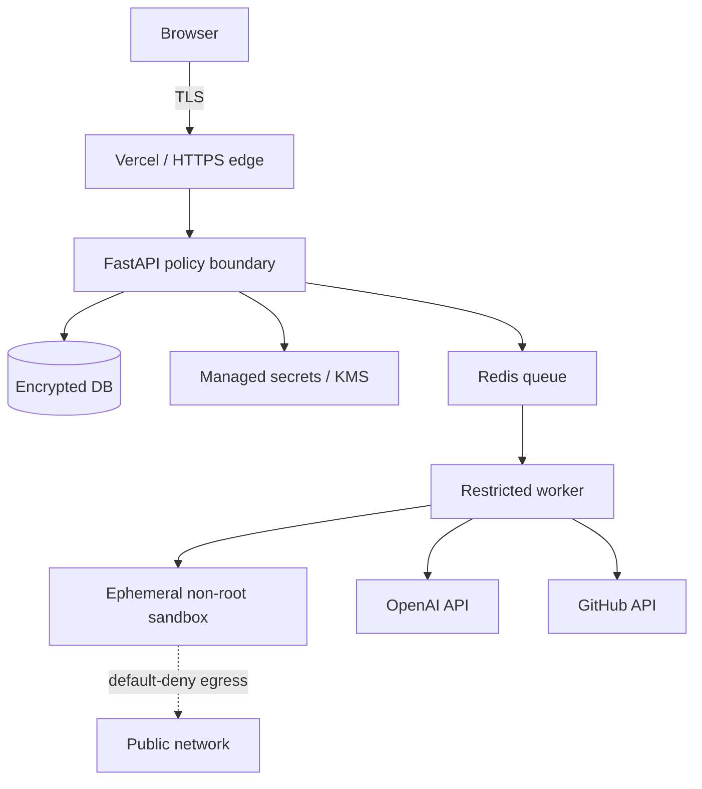

| Control area | Architecture control |
|---|---|
| Identity/session | Secure HTTP-only cookies, CSRF protection, short session lifetime/rotation, server-side validation. |
| Secrets | KMS-backed envelope encryption, secret redaction before prompts/logs/artifacts, rotation/revocation on disconnect. |
| GitHub | Minimum OAuth scopes, webhook signature verification if webhooks are enabled, scoped repository operations. |
| Model safety | Repository content treated as untrusted; structured outputs; tool broker; prompt/context bounds; no raw credentials. |
| Execution | Ephemeral non-root container, filesystem isolation, CPU/memory/time limits, default-deny egress, no host mounts. |
| Change safety | Approval baseline, read-only default/protected branches, path policy, explicit export, no autonomous merge/deploy. |
| Application | Input schema validation, output encoding, CSP, dependency scanning, rate limits, secure headers. |
| Audit/retention | Immutable security-relevant events, retention/deletion jobs, access-controlled diagnostics. |

Threat modeling must precede external beta. Particular scenarios: malicious repository content/prompt injection, poisoned dependencies/test scripts, token theft, cross-tenant authorization failure, SSRF from sandbox, job replay, and export to a changed branch.

## 22. Performance Considerations

The interactive path is optimized separately from asynchronous execution. Static frontend assets and server-rendered shells are delivered by Vercel's edge network; FastAPI endpoints use pagination, narrow projections, and appropriate PostgreSQL indexes. Dashboard summaries are cached briefly in Redis and invalidated after committed events. Artifact bodies are lazy-loaded and chunked; diff rendering virtualizes large file lists and lines.

Analysis and agent operations are bounded by explicit budgets: repository size (250 MB snapshot), file count (100,000), run duration (30 minutes), per-artifact size (10 MB), model context/output tokens, and sandbox command duration. The UI shows progress without pretending that all model tasks have deterministic completion times. SSE is preferred over WebSockets for one-way event delivery because it is simpler to operate through Vercel/Render and matches the supervisory use case.

## 23. Scalability Considerations

The modular monolith scales horizontally at the API and worker tiers. PostgreSQL remains the consistency anchor, with read-optimized indexes and later read replicas only if evidence requires them. Queue class separation and per-project concurrency controls prevent noisy tenants from monopolizing workers. Object storage absorbs artifact growth; lifecycle rules remove stale snapshots/logs after retention windows.

| Growth stage | Evolution |
|---|---|
| MVP | Single API deployment, worker pool, managed PostgreSQL/Redis, one region, bounded project sizes. |
| Early scale | Autoscale workers by queue depth, separate analysis/execution pools, add read cache and replica as measured. |
| Team/enterprise | Partition by tenant, region-aware storage/execution, stronger policy service, private networking, dedicated capacity. |
| Multi-service | Extract sandbox orchestration, agent runtime, and analytics only after operational boundaries and load justify it. |

Rate limiting applies at edge/API and for outbound GitHub/OpenAI calls. Backpressure means queued state with an honest explanation, not accepting unlimited runs. The architecture avoids relying on in-memory affinity, allowing safe rolling deployments.

## 24. Folder Structure

The following is a conceptual monorepo organization, not a code prescription. It keeps product surfaces, domain modules, worker logic, and infrastructure independently navigable.

```text
CodePilot-OS/
  apps/
    web/                    # Next.js application
      app/                  # routes and layouts
      components/           # UI and feature components
      features/             # project, request, run, review features
      lib/                  # API client, session, presentation helpers
    api/                    # FastAPI application
      api/                  # HTTP routes and schemas
      application/          # use cases and command handlers
      domain/               # entities, policies, transition rules
      infrastructure/       # DB, queue, GitHub, OpenAI, storage adapters
      workers/              # task handlers and orchestration
  packages/
    contracts/              # versioned API/event/artifact schemas
    config/                 # shared lint/build configuration
  infra/
    vercel/                 # frontend deployment configuration
    render/                 # API, worker, data-service definitions
    migrations/             # database schema migrations
  docs/
    architecture/           # ADRs, diagrams, operational notes
  tests/
    fixtures/               # safe fixture repositories
```

## 25. Service Boundaries

| Boundary | Initial implementation | Extract when | Contract |
|---|---|---|---|
| API/application | One FastAPI deployable | Rarely; remains command/read facade. | REST/OpenAPI and domain commands. |
| Workflow/agents | Worker module in same repository | Queue throughput, runtime isolation, independent releases demand it. | Versioned jobs and artifacts. |
| Sandbox orchestration | Worker adapter | Multiple execution backends or strict tenancy needs. | Create/cancel/status sandbox interface. |
| GitHub integration | API/worker adapter | Multiple SCM providers or webhook volume. | Repository, snapshot, export interface. |
| Artifact storage | Storage adapter | Compliance/region/archive requirements. | Artifact metadata and signed-access interface. |
| Analytics | Event sink/projection | Reporting load affects product database. | Append-only event export. |

Avoid a separate microservice per agent in the MVP. Agents share orchestration controls and a data model; splitting them would add operational failure modes without improving user value. Role isolation is achieved by schemas, permissions, and policy-scoped tools.

## 26. Sequence Diagrams

### 26.1 Import and analysis

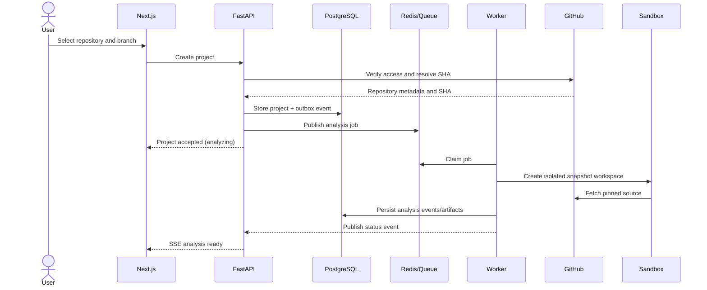

### 26.2 Plan approval and execution

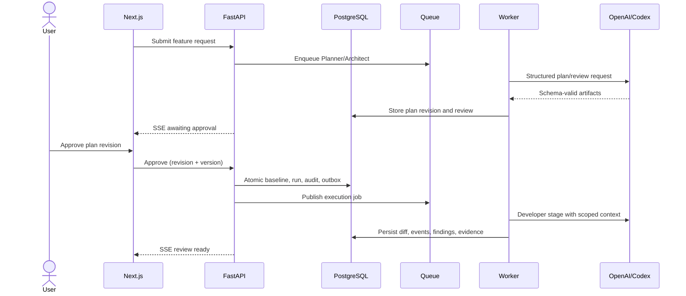

## 27. Component Diagrams

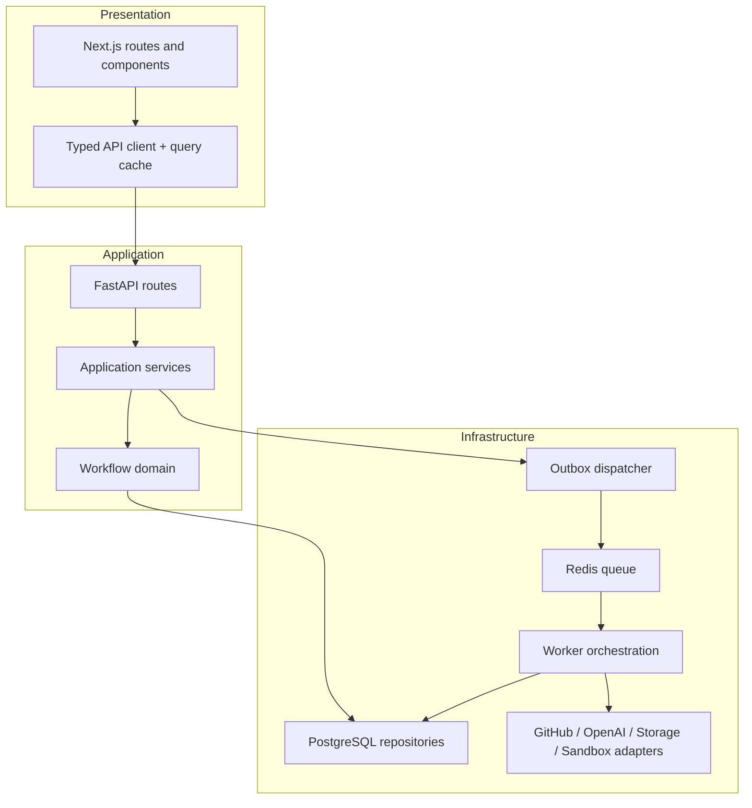

The diagram represents logical components, not necessarily independently deployed services. Dependencies point inward: UI depends on API contracts; application depends on domain interfaces; infrastructure satisfies those interfaces.

## 28. Deployment Architecture

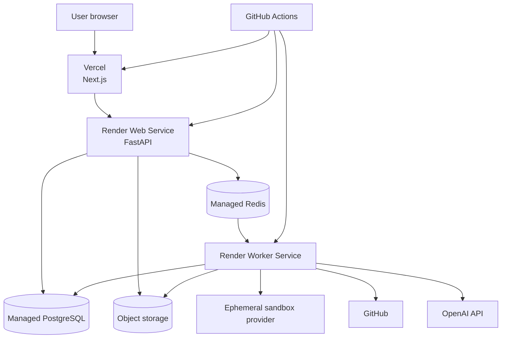

Vercel hosts the web application for fast global delivery and preview environments. Render hosts the FastAPI API and worker as separately scalable processes with managed data services. Production environments use distinct credentials, data stores, buckets/prefixes, OAuth apps/callbacks, and OpenAI project keys from staging. All traffic is TLS-encrypted; internal credentials use environment-level secret management rather than repository files.

## 29. CI/CD Pipeline

```mermaid
flowchart LR
  A[Pull request] --> B[Format, lint, type check]
  B --> C[Unit and integration tests]
  C --> D[Dependency and secret scan]
  D --> E[Build web/API/worker]
  E --> F[Preview or staging deploy]
  F --> G[Smoke tests with fixture repo]
  G --> H[Approved main merge]
  H --> I[Production deploy]
  I --> J[Migration + health verification]
```

GitHub Actions runs quality gates on every pull request. A staging deployment runs end-to-end smoke tests against safe fixture repositories only; it must not execute arbitrary contributor repositories. Database migrations are backward compatible, versioned, and run before application features that depend on them are enabled. Production release uses a health check and rollback plan. OpenAI/GitHub integration tests use sandboxed test credentials and are never logged.

## 30. Design Decisions and Trade-offs

| Decision | Rationale | Trade-off |
|---|---|---|
| Modular monolith over microservices | Fastest safe MVP while preserving clear seams. | Less independent deployment until scale warrants extraction. |
| PostgreSQL as workflow source of truth | Transactions support approvals, audits, and state invariants. | Requires disciplined schema/index management. |
| Redis queue plus transactional outbox | Simple managed infrastructure and resilient async publishing. | Requires careful idempotency and monitoring. |
| SSE over WebSockets | One-way live status fits product needs and is operationally simpler. | No low-latency bidirectional collaboration channel. |
| Structured agent artifacts | Auditability, validation, reliable handoffs. | More prompt/schema design effort than free-form chat. |
| Ephemeral sandbox execution | Limits repository-code risk and improves cleanup. | Adds startup latency and provider complexity. |
| Explicit approval and export | Matches trust/security PRD goals. | Reduces perceived autonomy; intentional for MVP. |
| GitHub-only MVP | Focuses integration quality. | Excludes GitLab/Bitbucket users initially. |
| Object storage for blobs | Scales artifact size/cost separately from relational queries. | Requires signed access and lifecycle management. |

## 31. Risks

| Risk | Architecture response | Residual concern |
|---|---|---|
| Prompt injection via repository | Untrusted-content labeling, context filter, tool broker, no policy delegation to model. | Model behavior still needs continuous evaluation. |
| Untrusted tests or dependencies | Ephemeral non-root sandbox, egress denial, limits, command allowlist/approval. | Sandboxing must be independently hardened. |
| Duplicate jobs/events | Outbox, idempotency keys, attempt IDs, optimistic state transitions. | Operational bugs can still require reconciliation tooling. |
| Agent hallucination | Cited context, schema validation, reviewer/QA/evaluator stages, human approval. | Quality is probabilistic; no correctness guarantee. |
| API/worker outage | Durable data/outbox, retryable jobs, stateless API scale-out. | Long outages delay run completion. |
| GitHub/OpenAI limits | Backoff, budgets, quota dashboards, visible waiting state. | External provider availability remains a dependency. |
| Sensitive artifact exposure | Redaction, encryption, signed access, retention controls. | Detection has false negatives; policy must evolve. |
| Cost spike | Per-run budgets, concurrency quotas, observability. | Complex repos may still be expensive; product limits required. |

## 32. Future Improvements

1. Add pull-request creation and GitHub status integration after export behavior and security controls prove reliable.
2. Introduce collaboration features, comments, and granular approval policies for small teams.
3. Support GitLab and Bitbucket through a source-control provider interface.
4. Add durable repository memory with user correction, source citations, expiration, and versioning.
5. Add organization tenancy, SSO/SCIM, RBAC expansion, audit export, private networking, managed secrets, and regional data controls.
6. Evolve the sandbox abstraction toward self-hosted/private runners only after a dedicated security and operational design.
7. Build evaluation datasets from opt-in, sanitized run outcomes to measure plan quality, code-review precision, and false-positive rates.
8. Extract agent runtime/sandbox orchestration into dedicated services only when scale, isolation, or deployment cadence demonstrates a clear benefit.

## Appendix A: Architecture Principles

1. Human authority precedes automation: write-capable execution and export require explicit, recorded human actions.
2. Evidence over assertion: important AI claims, checks, and transitions have artifacts or source citations.
3. Durable state over ephemeral coordination: PostgreSQL defines reality; queues and caches accelerate it.
4. Least privilege by default: agents see and can do only what their role and approved baseline require.
5. Isolation is a product feature: repository code does not run in API processes or with production credentials.
6. Modular now, distributed later: retain clear interfaces without paying premature microservice complexity.
7. Honest status: blocked, failed, skipped, and partial outcomes are displayed distinctly from success.

